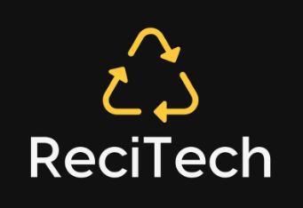

# fiap-recitech

# Substitutiva Global Solution - ReciTech

## 

Projeto criado para entrega de trabalho da FIAP, Substitutiva Global Solution ano 2, semestre 2. 
ReciTech é um aplicativo desenvolvido para facilitar a identificação e localização de pontos de coleta seletiva e ecopontos na cidade de São Paulo. 

## Tecnologias Utilizadas

- **React Native:** Framework para construção de interfaces nativas para dispositivos móveis.
- **Expo:** Ferramentas e serviços para desenvolvimento e visualização de aplicativos React Native.
- **React Navigation:** Biblioteca para navegação em aplicativos React Native.
- **Expo Vector Icons:** Biblioteca de ícones.
- **Expo Image Picker:** Biblioteca para seleção de imagens e captura de fotos.
- **Expo Location:** Biblioteca para obtenção de informações de localização do dispositivo.
